# LangChain Python 深度源码分析

> 本文档基于 LangChain Python monorepo 源码进行深度分析，涵盖架构设计、核心模块、关键抽象、数据流、
> 集成机制及学习路径。所有 Mermaid 图表均基于实际源码结构绘制。

---

## 目录

1. [项目总览与仓库架构](#1-项目总览与仓库架构)
2. [核心层 langchain-core 深度分析](#2-核心层-langchain-core-深度分析)
3. [LCEL — Runnable 体系](#3-lcel--runnable-体系)
4. [消息系统 Messages](#4-消息系统-messages)
5. [语言模型抽象 Language Models](#5-语言模型抽象-language-models)
6. [Prompt 模板系统](#6-prompt-模板系统)
7. [工具系统 Tools](#7-工具系统-tools)
8. [输出解析器 Output Parsers](#8-输出解析器-output-parsers)
9. [文档与向量存储](#9-文档与向量存储)
10. [回调与追踪系统](#10-回调与追踪系统)
11. [序列化与反序列化](#11-序列化与反序列化)
12. [实现层 langchain (v1)](#12-实现层-langchain-v1)
13. [集成层 Partners](#13-集成层-partners)
14. [文本分割器 Text Splitters](#14-文本分割器-text-splitters)
15. [标准测试框架](#15-标准测试框架)
16. [辅助模块](#16-辅助模块)
17. [完整数据流：从用户输入到模型输出](#17-完整数据流从用户输入到模型输出)
18. [学习路径与面试准备](#18-学习路径与面试准备)

---

## 1. 项目总览与仓库架构

### 1.1 Monorepo 全景架构图

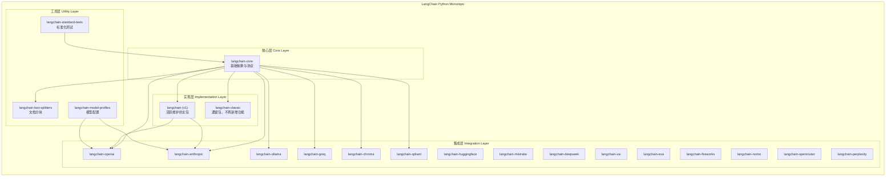
```mermaid
graph TB
    subgraph "LangChain Python Monorepo"
        direction TB

        subgraph "核心层 Core Layer"
            CORE["langchain-core<br/>基础抽象与协议"]
        end

        subgraph "实现层 Implementation Layer"
            V1["langchain (v1)<br/>活跃维护的主包"]
            CLASSIC["langchain-classic<br/>遗留包，不再新增功能"]
        end

        subgraph "集成层 Integration Layer"
            OPENAI["langchain-openai"]
            ANTHROPIC["langchain-anthropic"]
            OLLAMA["langchain-ollama"]
            GROQ["langchain-groq"]
            CHROMA["langchain-chroma"]
            QDRANT["langchain-qdrant"]
            HF["langchain-huggingface"]
            MISTRAL["langchain-mistralai"]
            DEEPSEEK["langchain-deepseek"]
            XAI["langchain-xai"]
            EXA["langchain-exa"]
            FIREWORKS["langchain-fireworks"]
            NOMIC["langchain-nomic"]
            OPENROUTER["langchain-openrouter"]
            PERPLEXITY["langchain-perplexity"]
        end

        subgraph "工具层 Utility Layer"
            TS["langchain-text-splitters<br/>文档分块"]
            MP["langchain-model-profiles<br/>模型配置"]
            ST["langchain-standard-tests<br/>标准化测试"]
        end
    end

    CORE --> V1
    CORE --> CLASSIC
    CORE --> OPENAI
    CORE --> ANTHROPIC
    CORE --> OLLAMA
    CORE --> GROQ
    CORE --> CHROMA
    CORE --> QDRANT
    CORE --> TS
    V1 --> OPENAI
    V1 --> ANTHROPIC
    ST --> CORE
    MP --> OPENAI
    MP --> ANTHROPIC
```

### 1.2 包依赖关系

| 包名 | 路径 | 角色 | 依赖 |
|------|------|------|------|
| `langchain-core` | `libs/core/` | 基础抽象、接口、协议 | pydantic, typing-extensions |
| `langchain` (v1) | `libs/langchain_v1/` | 高层公共工具、Agent 工厂 | langchain-core |
| `langchain-classic` | `libs/langchain/` | 遗留实现（不再新增功能） | langchain-core |
| `langchain-openai` | `libs/partners/openai/` | OpenAI 集成 | langchain-core, openai |
| `langchain-anthropic` | `libs/partners/anthropic/` | Anthropic 集成 | langchain-core, anthropic |
| `langchain-text-splitters` | `libs/text-splitters/` | 文档分块工具 | langchain-core |
| `langchain-model-profiles` | `libs/model-profiles/` | 模型能力配置 | — |
| `langchain-standard-tests` | `libs/standard-tests/` | 集成标准测试套件 | langchain-core, pytest |

### 1.3 开发工具链

- **uv** — 快速 Python 包管理器（替代 pip/poetry）
- **ruff** — 高速 Python linter + formatter
- **mypy** — 静态类型检查
- **pytest** — 测试框架
- **make** — 任务运行器

---

## 2. 核心层 langchain-core 深度分析

`langchain-core` 是整个 LangChain 生态的基石，定义了所有核心抽象和协议。用户不需要直接使用它，
但所有上层包都依赖于它。

### 2.1 核心模块全景

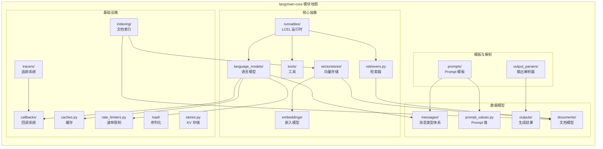
```mermaid
graph LR
    subgraph "langchain-core 模块地图"
        direction TB

        subgraph "数据模型"
            MSG["messages/<br/>消息类型体系"]
            DOC["documents/<br/>文档模型"]
            PV["prompt_values.py<br/>Prompt 值"]
            OUT["outputs/<br/>生成结果"]
        end

        subgraph "核心抽象"
            RUN["runnables/<br/>LCEL 运行时"]
            LM["language_models/<br/>语言模型"]
            EMB["embeddings/<br/>嵌入模型"]
            VS["vectorstores/<br/>向量存储"]
            RET["retrievers.py<br/>检索器"]
            TOOL["tools/<br/>工具"]
        end

        subgraph "模板与解析"
            PROMPT["prompts/<br/>Prompt 模板"]
            OP["output_parsers/<br/>输出解析器"]
        end

        subgraph "基础设施"
            CB["callbacks/<br/>回调系统"]
            TR["tracers/<br/>追踪系统"]
            LOAD["load/<br/>序列化"]
            IDX["indexing/<br/>文档索引"]
            CACHE["caches.py<br/>缓存"]
            STORE["stores.py<br/>KV 存储"]
            RL["rate_limiters.py<br/>速率限制"]
        end
    end

    RUN --> LM
    RUN --> TOOL
    RUN --> RET
    LM --> MSG
    LM --> CB
    LM --> CACHE
    LM --> RL
    PROMPT --> MSG
    PROMPT --> PV
    OP --> OUT
    VS --> EMB
    VS --> DOC
    RET --> DOC
    IDX --> DOC
    IDX --> VS
    TR --> CB
```

### 2.2 模块职责一览

| 模块 | 文件数 | 核心类/函数 | 职责 |
|------|--------|------------|------|
| `runnables/` | 12+ | `Runnable`, `RunnableSequence`, `RunnableParallel` | LCEL 表达式语言运行时 |
| `language_models/` | 7 | `BaseLanguageModel`, `BaseChatModel` | 语言模型抽象接口 |
| `messages/` | 11+ | `BaseMessage`, `AIMessage`, `HumanMessage`, `ToolMessage` | 对话消息类型体系 |
| `prompts/` | 11 | `ChatPromptTemplate`, `PromptTemplate` | Prompt 模板构建 |
| `tools/` | 6 | `BaseTool`, `StructuredTool`, `@tool` | 工具定义与调用 |
| `output_parsers/` | 11 | `StrOutputParser`, `JsonOutputParser`, `PydanticOutputParser` | LLM 输出解析 |
| `callbacks/` | 7 | `BaseCallbackHandler`, `CallbackManager` | 事件回调系统 |
| `tracers/` | 15 | `BaseTracer`, `LangChainTracer` | 可观测性追踪 |
| `vectorstores/` | 4 | `VectorStore`, `InMemoryVectorStore` | 向量存储抽象 |
| `documents/` | 4 | `Document`, `Blob` | 文档数据模型 |
| `embeddings/` | 3 | `Embeddings` | 嵌入模型接口 |
| `load/` | 6 | `Serializable`, `dumps`, `loads` | 序列化/反序列化 |
| `indexing/` | 4 | `RecordManager`, `DocumentIndex` | 文档索引管理 |

---

## 3. LCEL — Runnable 体系

LCEL（LangChain Expression Language）是 LangChain 最核心的设计，所有组件都实现 `Runnable` 接口，
通过管道操作符 `|` 组合成链。

### 3.1 Runnable 类继承体系

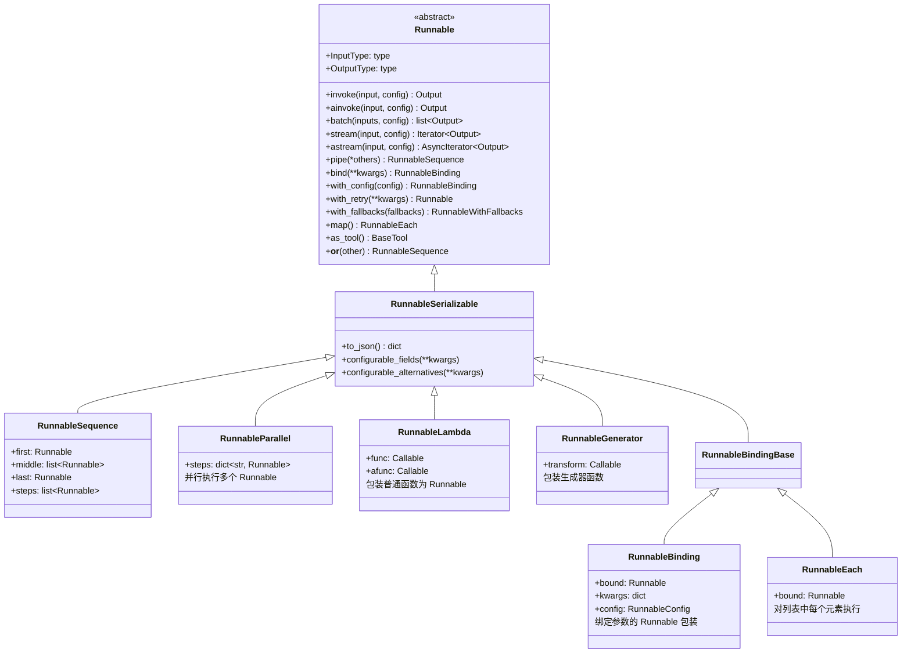
```mermaid
classDiagram
    class Runnable {
        <<abstract>>
        +InputType: type
        +OutputType: type
        +invoke(input, config) Output
        +ainvoke(input, config) Output
        +batch(inputs, config) list~Output~
        +stream(input, config) Iterator~Output~
        +astream(input, config) AsyncIterator~Output~
        +pipe(*others) RunnableSequence
        +bind(**kwargs) RunnableBinding
        +with_config(config) RunnableBinding
        +with_retry(**kwargs) Runnable
        +with_fallbacks(fallbacks) RunnableWithFallbacks
        +map() RunnableEach
        +as_tool() BaseTool
        +__or__(other) RunnableSequence
    }

    class RunnableSerializable {
        +to_json() dict
        +configurable_fields(**kwargs)
        +configurable_alternatives(**kwargs)
    }

    class RunnableSequence {
        +first: Runnable
        +middle: list~Runnable~
        +last: Runnable
        +steps: list~Runnable~
    }

    class RunnableParallel {
        +steps: dict~str, Runnable~
        并行执行多个 Runnable
    }

    class RunnableLambda {
        +func: Callable
        +afunc: Callable
        包装普通函数为 Runnable
    }

    class RunnableGenerator {
        +transform: Callable
        包装生成器函数
    }

    class RunnableBinding {
        +bound: Runnable
        +kwargs: dict
        +config: RunnableConfig
        绑定参数的 Runnable 包装
    }

    class RunnableEach {
        +bound: Runnable
        对列表中每个元素执行
    }

    Runnable <|-- RunnableSerializable
    RunnableSerializable <|-- RunnableSequence
    RunnableSerializable <|-- RunnableParallel
    RunnableSerializable <|-- RunnableLambda
    RunnableSerializable <|-- RunnableGenerator
    RunnableSerializable <|-- RunnableBindingBase
    RunnableBindingBase <|-- RunnableBinding
    RunnableBindingBase <|-- RunnableEach
```

### 3.2 LCEL 管道组合原理

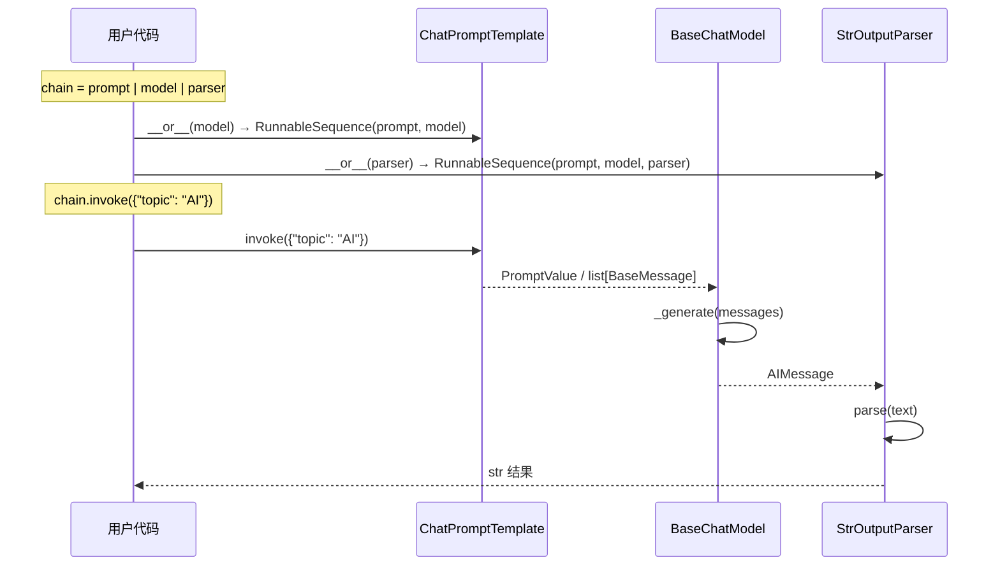
```mermaid
sequenceDiagram
    participant User as 用户代码
    participant Prompt as ChatPromptTemplate
    participant Model as BaseChatModel
    participant Parser as StrOutputParser

    Note over User: chain = prompt | model | parser
    User->>Prompt: __or__(model) → RunnableSequence(prompt, model)
    User->>Parser: __or__(parser) → RunnableSequence(prompt, model, parser)

    Note over User: chain.invoke({"topic": "AI"})
    User->>Prompt: invoke({"topic": "AI"})
    Prompt-->>Model: PromptValue / list[BaseMessage]
    Model->>Model: _generate(messages)
    Model-->>Parser: AIMessage
    Parser->>Parser: parse(text)
    Parser-->>User: str 结果
```

### 3.3 Runnable 核心方法矩阵

| 方法 | 同步 | 异步 | 批量 | 流式 | 说明 |
|------|------|------|------|------|------|
| `invoke` | ✅ | `ainvoke` | — | — | 单次调用 |
| `batch` | ✅ | `abatch` | ✅ | — | 批量调用 |
| `stream` | ✅ | `astream` | — | ✅ | 流式输出 |
| `transform` | ✅ | `atransform` | — | ✅ | 流式输入+输出 |
| `astream_events` | — | ✅ | — | ✅ | 事件流（v2） |
| `astream_log` | — | ✅ | — | ✅ | 日志流 |

### 3.4 RunnableConfig 配置体系

`RunnableConfig` 是贯穿整个执行链的配置对象：

```python
class RunnableConfig(TypedDict, total=False):
    tags: list[str]              # 标签，用于过滤追踪
    metadata: dict[str, Any]     # 元数据
    callbacks: Callbacks          # 回调处理器
    run_name: str                # 运行名称
    max_concurrency: int         # 最大并发数
    recursion_limit: int         # 递归深度限制
    configurable: dict[str, Any] # 可配置参数
    run_id: UUID                 # 运行 ID
```

---

## 4. 消息系统 Messages

消息系统是 LangChain 与 LLM 交互的核心数据模型，支持多模态内容。

### 4.1 消息类型继承体系

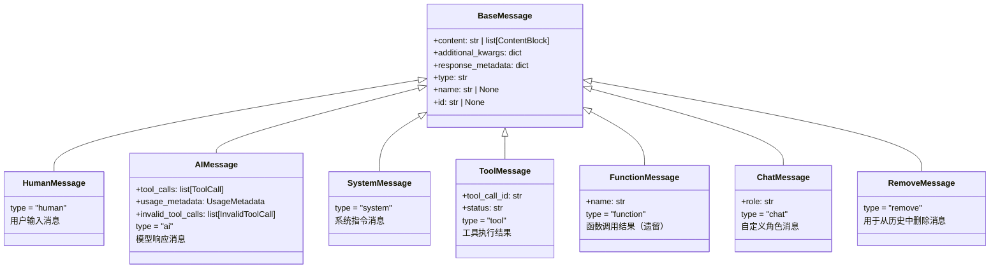
```mermaid
classDiagram
    class BaseMessage {
        +content: str | list[ContentBlock]
        +additional_kwargs: dict
        +response_metadata: dict
        +type: str
        +name: str | None
        +id: str | None
    }

    class HumanMessage {
        type = "human"
        用户输入消息
    }

    class AIMessage {
        +tool_calls: list[ToolCall]
        +usage_metadata: UsageMetadata
        +invalid_tool_calls: list[InvalidToolCall]
        type = "ai"
        模型响应消息
    }

    class SystemMessage {
        type = "system"
        系统指令消息
    }

    class ToolMessage {
        +tool_call_id: str
        +status: str
        type = "tool"
        工具执行结果
    }

    class FunctionMessage {
        +name: str
        type = "function"
        函数调用结果（遗留）
    }

    class ChatMessage {
        +role: str
        type = "chat"
        自定义角色消息
    }

    class RemoveMessage {
        type = "remove"
        用于从历史中删除消息
    }

    BaseMessage <|-- HumanMessage
    BaseMessage <|-- AIMessage
    BaseMessage <|-- SystemMessage
    BaseMessage <|-- ToolMessage
    BaseMessage <|-- FunctionMessage
    BaseMessage <|-- ChatMessage
    BaseMessage <|-- RemoveMessage
```

### 4.2 多模态内容块体系

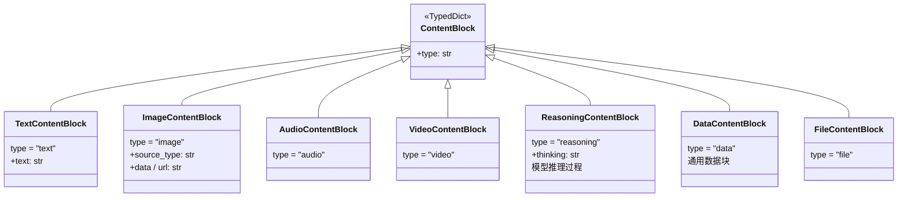
```mermaid
classDiagram
    class ContentBlock {
        <<TypedDict>>
        +type: str
    }

    class TextContentBlock {
        type = "text"
        +text: str
    }

    class ImageContentBlock {
        type = "image"
        +source_type: str
        +data / url: str
    }

    class AudioContentBlock {
        type = "audio"
    }

    class VideoContentBlock {
        type = "video"
    }

    class ReasoningContentBlock {
        type = "reasoning"
        +thinking: str
        模型推理过程
    }

    class DataContentBlock {
        type = "data"
        通用数据块
    }

    class FileContentBlock {
        type = "file"
    }

    ContentBlock <|-- TextContentBlock
    ContentBlock <|-- ImageContentBlock
    ContentBlock <|-- AudioContentBlock
    ContentBlock <|-- VideoContentBlock
    ContentBlock <|-- ReasoningContentBlock
    ContentBlock <|-- DataContentBlock
    ContentBlock <|-- FileContentBlock
```

### 4.3 消息工具函数

| 函数 | 用途 |
|------|------|
| `convert_to_messages()` | 将各种格式转换为 BaseMessage 列表 |
| `convert_to_openai_messages()` | 转换为 OpenAI API 格式 |
| `filter_messages()` | 按类型/名称过滤消息 |
| `merge_message_runs()` | 合并连续同类型消息 |
| `trim_messages()` | 按 token 数裁剪消息历史 |
| `get_buffer_string()` | 将消息列表转为字符串 |

---

## 5. 语言模型抽象 Language Models

### 5.1 语言模型类层次

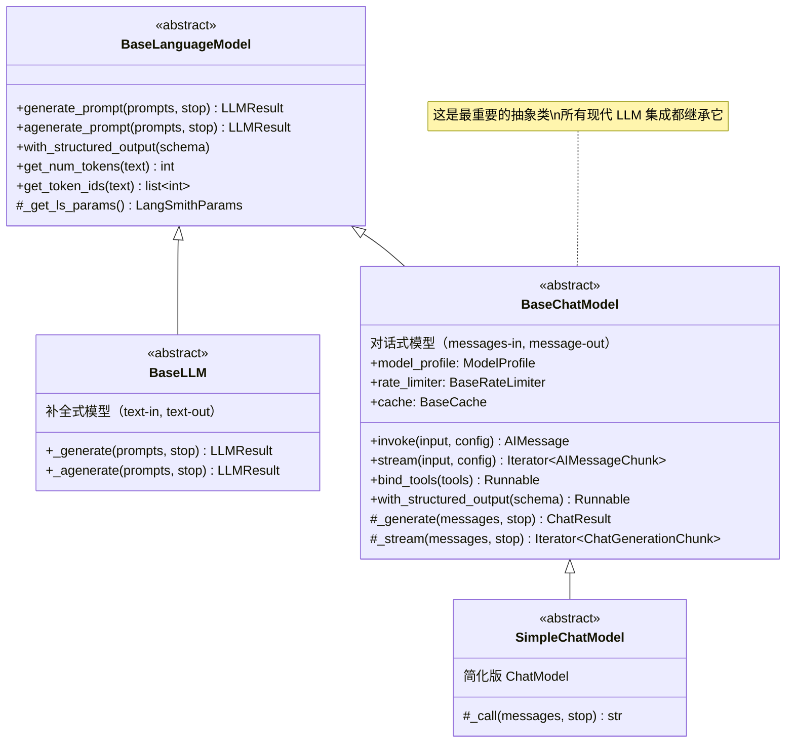
```mermaid
classDiagram
    class BaseLanguageModel {
        <<abstract>>
        +generate_prompt(prompts, stop) LLMResult
        +agenerate_prompt(prompts, stop) LLMResult
        +with_structured_output(schema)
        +get_num_tokens(text) int
        +get_token_ids(text) list~int~
        #_get_ls_params() LangSmithParams
    }

    class BaseLLM {
        <<abstract>>
        补全式模型（text-in, text-out）
        +_generate(prompts, stop) LLMResult
        +_agenerate(prompts, stop) LLMResult
    }

    class BaseChatModel {
        <<abstract>>
        对话式模型（messages-in, message-out）
        +model_profile: ModelProfile
        +rate_limiter: BaseRateLimiter
        +cache: BaseCache
        +invoke(input, config) AIMessage
        +stream(input, config) Iterator~AIMessageChunk~
        +bind_tools(tools) Runnable
        +with_structured_output(schema) Runnable
        #_generate(messages, stop) ChatResult
        #_stream(messages, stop) Iterator~ChatGenerationChunk~
    }

    class SimpleChatModel {
        <<abstract>>
        简化版 ChatModel
        #_call(messages, stop) str
    }

    BaseLanguageModel <|-- BaseLLM
    BaseLanguageModel <|-- BaseChatModel
    BaseChatModel <|-- SimpleChatModel

    note for BaseChatModel "这是最重要的抽象类\n所有现代 LLM 集成都继承它"
```

### 5.2 BaseChatModel 调用流程

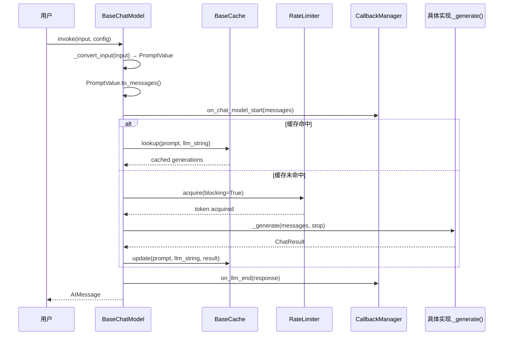
```mermaid
sequenceDiagram
    participant User as 用户
    participant BCM as BaseChatModel
    participant Cache as BaseCache
    participant RL as RateLimiter
    participant CB as CallbackManager
    participant Impl as 具体实现._generate()

    User->>BCM: invoke(input, config)
    BCM->>BCM: _convert_input(input) → PromptValue
    BCM->>BCM: PromptValue.to_messages()
    BCM->>CB: on_chat_model_start(messages)

    alt 缓存命中
        BCM->>Cache: lookup(prompt, llm_string)
        Cache-->>BCM: cached generations
    else 缓存未命中
        BCM->>RL: acquire(blocking=True)
        RL-->>BCM: token acquired
        BCM->>Impl: _generate(messages, stop)
        Impl-->>BCM: ChatResult
        BCM->>Cache: update(prompt, llm_string, result)
    end

    BCM->>CB: on_llm_end(response)
    BCM-->>User: AIMessage
```

### 5.3 流式输出机制

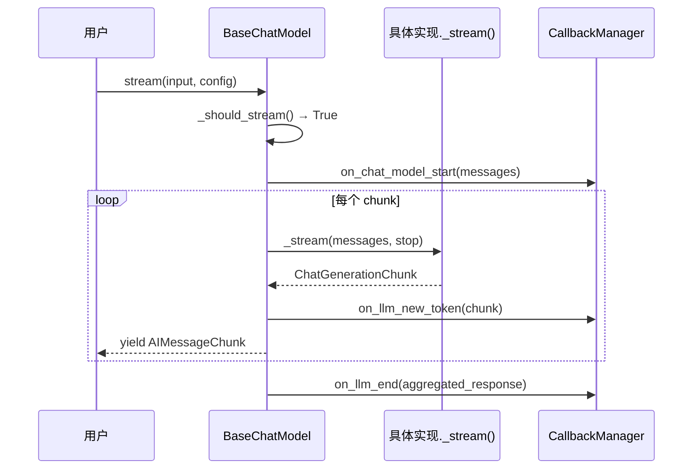
```mermaid
sequenceDiagram
    participant User as 用户
    participant BCM as BaseChatModel
    participant Impl as 具体实现._stream()
    participant CB as CallbackManager

    User->>BCM: stream(input, config)
    BCM->>BCM: _should_stream() → True
    BCM->>CB: on_chat_model_start(messages)

    loop 每个 chunk
        BCM->>Impl: _stream(messages, stop)
        Impl-->>BCM: ChatGenerationChunk
        BCM->>CB: on_llm_new_token(chunk)
        BCM-->>User: yield AIMessageChunk
    end

    BCM->>CB: on_llm_end(aggregated_response)
```

### 5.4 ModelProfile 模型能力配置

`ModelProfile` 描述模型的能力特征，用于自动适配功能：

```python
# 关键字段
class ModelProfile:
    supports_tool_calling: bool      # 是否支持工具调用
    supports_structured_output: bool # 是否支持结构化输出
    supports_vision: bool            # 是否支持视觉输入
    supports_audio_input: bool       # 是否支持音频输入
    supports_video_input: bool       # 是否支持视频输入
    supports_thinking: bool          # 是否支持推理过程
    max_input_tokens: int            # 最大输入 token 数
    max_output_tokens: int           # 最大输出 token 数
```

---

## 6. Prompt 模板系统

### 6.1 Prompt 模板类层次

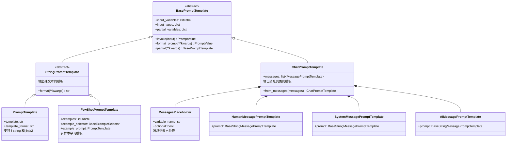
```mermaid
classDiagram
    class BasePromptTemplate {
        <<abstract>>
        +input_variables: list~str~
        +input_types: dict
        +partial_variables: dict
        +invoke(input) PromptValue
        +format_prompt(**kwargs) PromptValue
        +partial(**kwargs) BasePromptTemplate
    }

    class StringPromptTemplate {
        <<abstract>>
        输出纯文本的模板
        +format(**kwargs) str
    }

    class PromptTemplate {
        +template: str
        +template_format: str
        支持 f-string 和 jinja2
    }

    class ChatPromptTemplate {
        +messages: list~MessagePromptTemplate~
        +from_messages(messages) ChatPromptTemplate
        输出消息列表的模板
    }

    class FewShotPromptTemplate {
        +examples: list~dict~
        +example_selector: BaseExampleSelector
        +example_prompt: PromptTemplate
        少样本学习模板
    }

    class MessagesPlaceholder {
        +variable_name: str
        +optional: bool
        消息列表占位符
    }

    class HumanMessagePromptTemplate {
        +prompt: BaseStringMessagePromptTemplate
    }

    class SystemMessagePromptTemplate {
        +prompt: BaseStringMessagePromptTemplate
    }

    class AIMessagePromptTemplate {
        +prompt: BaseStringMessagePromptTemplate
    }

    BasePromptTemplate <|-- StringPromptTemplate
    BasePromptTemplate <|-- ChatPromptTemplate
    StringPromptTemplate <|-- PromptTemplate
    StringPromptTemplate <|-- FewShotPromptTemplate
    ChatPromptTemplate *-- MessagesPlaceholder
    ChatPromptTemplate *-- HumanMessagePromptTemplate
    ChatPromptTemplate *-- SystemMessagePromptTemplate
    ChatPromptTemplate *-- AIMessagePromptTemplate
```

### 6.2 ChatPromptTemplate 使用模式

```python
# 典型用法
prompt = ChatPromptTemplate.from_messages([
    ("system", "你是一个{role}助手"),
    MessagesPlaceholder("history"),       # 动态插入历史消息
    ("human", "{question}"),
])

# 调用
prompt.invoke({
    "role": "编程",
    "history": [HumanMessage("hi"), AIMessage("hello")],
    "question": "什么是 Python?"
})
# → ChatPromptValue(messages=[SystemMessage, HumanMessage, AIMessage, HumanMessage])
```

---

## 7. 工具系统 Tools

### 7.1 工具类层次

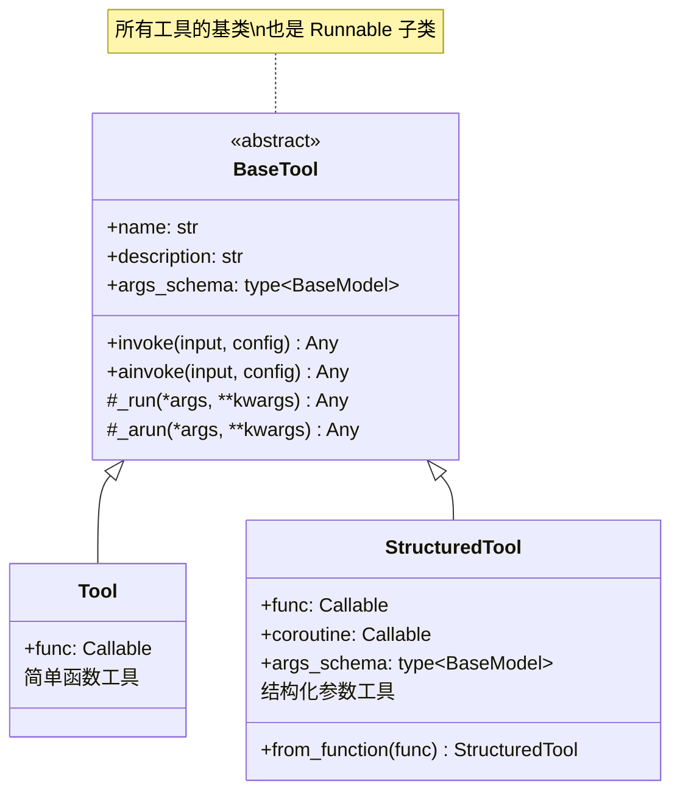
```mermaid
classDiagram
    class BaseTool {
        <<abstract>>
        +name: str
        +description: str
        +args_schema: type~BaseModel~
        +invoke(input, config) Any
        +ainvoke(input, config) Any
        #_run(*args, **kwargs) Any
        #_arun(*args, **kwargs) Any
    }

    class Tool {
        +func: Callable
        简单函数工具
    }

    class StructuredTool {
        +func: Callable
        +coroutine: Callable
        +args_schema: type~BaseModel~
        +from_function(func) StructuredTool
        结构化参数工具
    }

    BaseTool <|-- Tool
    BaseTool <|-- StructuredTool

    note for BaseTool "所有工具的基类\n也是 Runnable 子类"
```

### 7.2 @tool 装饰器

```python
from langchain_core.tools import tool

@tool
def search(query: str) -> str:
    """搜索互联网获取信息。

    Args:
        query: 搜索查询词
    """
    return f"搜索结果: {query}"

# 自动推断：
# - name = "search"
# - description = docstring
# - args_schema = 从类型注解自动生成 Pydantic model
```

### 7.3 工具调用流程

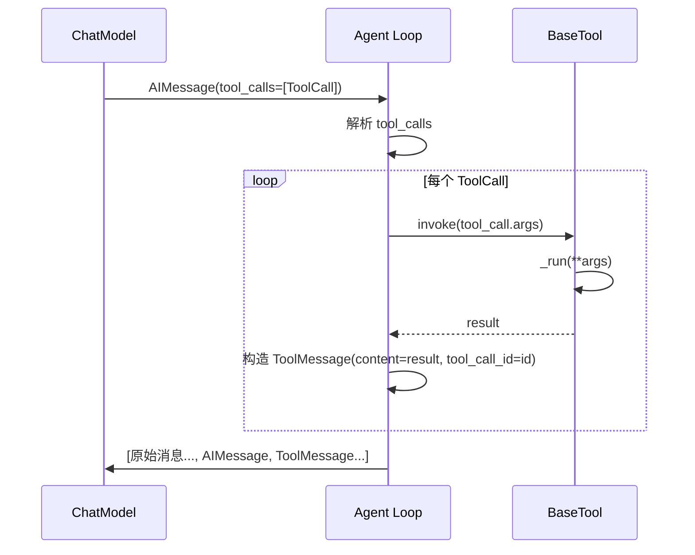
```mermaid
sequenceDiagram
    participant Model as ChatModel
    participant Agent as Agent Loop
    participant Tool as BaseTool

    Model->>Agent: AIMessage(tool_calls=[ToolCall])
    Agent->>Agent: 解析 tool_calls
    loop 每个 ToolCall
        Agent->>Tool: invoke(tool_call.args)
        Tool->>Tool: _run(**args)
        Tool-->>Agent: result
        Agent->>Agent: 构造 ToolMessage(content=result, tool_call_id=id)
    end
    Agent->>Model: [原始消息..., AIMessage, ToolMessage...]
```

---


## 8. 输出解析器 Output Parsers

### 8.1 解析器类层次

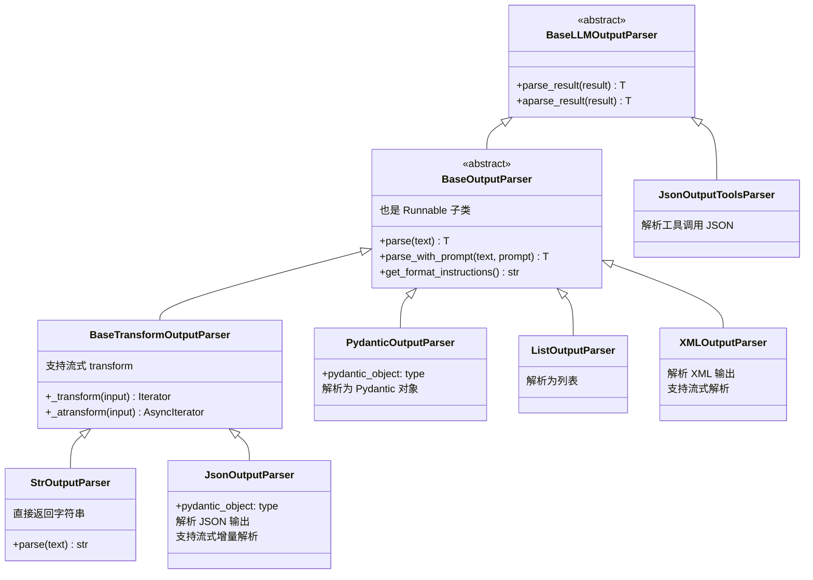
```mermaid
classDiagram
    class BaseLLMOutputParser {
        <<abstract>>
        +parse_result(result) T
        +aparse_result(result) T
    }

    class BaseOutputParser {
        <<abstract>>
        +parse(text) T
        +parse_with_prompt(text, prompt) T
        +get_format_instructions() str
        也是 Runnable 子类
    }

    class BaseTransformOutputParser {
        支持流式 transform
        +_transform(input) Iterator
        +_atransform(input) AsyncIterator
    }

    class StrOutputParser {
        直接返回字符串
        +parse(text) str
    }

    class JsonOutputParser {
        +pydantic_object: type
        解析 JSON 输出
        支持流式增量解析
    }

    class PydanticOutputParser {
        +pydantic_object: type
        解析为 Pydantic 对象
    }

    class ListOutputParser {
        解析为列表
    }

    class XMLOutputParser {
        解析 XML 输出
        支持流式解析
    }

    class JsonOutputToolsParser {
        解析工具调用 JSON
    }

    BaseLLMOutputParser <|-- BaseOutputParser
    BaseOutputParser <|-- BaseTransformOutputParser
    BaseTransformOutputParser <|-- StrOutputParser
    BaseTransformOutputParser <|-- JsonOutputParser
    BaseOutputParser <|-- PydanticOutputParser
    BaseOutputParser <|-- ListOutputParser
    BaseOutputParser <|-- XMLOutputParser
    BaseLLMOutputParser <|-- JsonOutputToolsParser
```

### 8.2 解析器在 LCEL 中的位置

```python
# 典型链式用法
chain = prompt | model | StrOutputParser()

# 结构化输出
chain = prompt | model | JsonOutputParser(pydantic_object=MySchema)

# 流式解析 — JsonOutputParser 支持增量 JSON 解析
async for chunk in chain.astream({"input": "..."}):
    print(chunk)  # 每次输出部分解析的 JSON
```

---

## 9. 文档与向量存储

### 9.1 文档模型

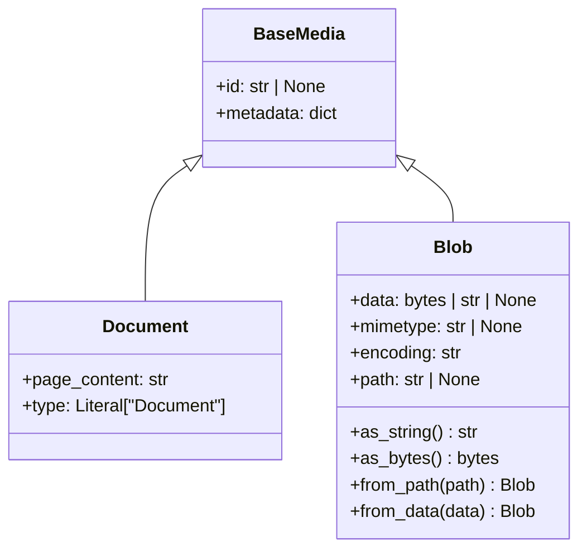
```mermaid
classDiagram
    class BaseMedia {
        +id: str | None
        +metadata: dict
    }

    class Document {
        +page_content: str
        +type: Literal["Document"]
    }

    class Blob {
        +data: bytes | str | None
        +mimetype: str | None
        +encoding: str
        +path: str | None
        +as_string() str
        +as_bytes() bytes
        +from_path(path) Blob
        +from_data(data) Blob
    }

    BaseMedia <|-- Document
    BaseMedia <|-- Blob
```

### 9.2 向量存储抽象

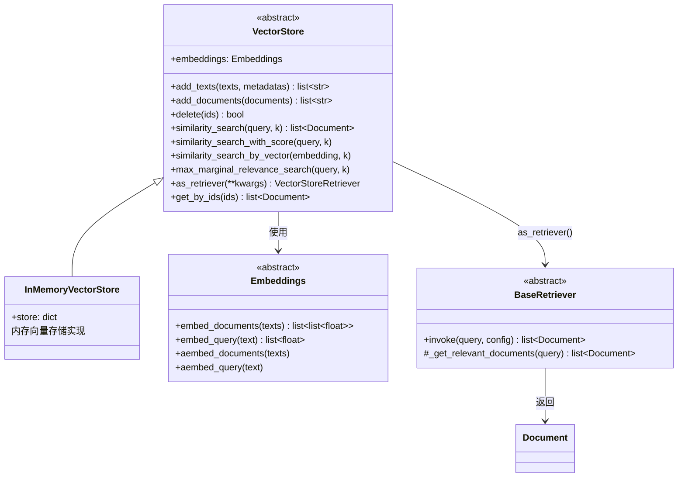
```mermaid
classDiagram
    class VectorStore {
        <<abstract>>
        +embeddings: Embeddings
        +add_texts(texts, metadatas) list~str~
        +add_documents(documents) list~str~
        +delete(ids) bool
        +similarity_search(query, k) list~Document~
        +similarity_search_with_score(query, k)
        +similarity_search_by_vector(embedding, k)
        +max_marginal_relevance_search(query, k)
        +as_retriever(**kwargs) VectorStoreRetriever
        +get_by_ids(ids) list~Document~
    }

    class InMemoryVectorStore {
        +store: dict
        内存向量存储实现
    }

    class Embeddings {
        <<abstract>>
        +embed_documents(texts) list~list~float~~
        +embed_query(text) list~float~
        +aembed_documents(texts)
        +aembed_query(text)
    }

    class BaseRetriever {
        <<abstract>>
        +invoke(query, config) list~Document~
        #_get_relevant_documents(query) list~Document~
    }

    VectorStore <|-- InMemoryVectorStore
    VectorStore --> Embeddings : 使用
    VectorStore --> BaseRetriever : as_retriever()
    BaseRetriever --> Document : 返回
```

### 9.3 RAG 数据流

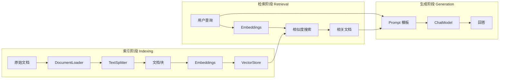
```mermaid
flowchart LR
    subgraph "索引阶段 Indexing"
        RAW["原始文档"] --> LOAD["DocumentLoader"]
        LOAD --> SPLIT["TextSplitter"]
        SPLIT --> CHUNKS["文档块"]
        CHUNKS --> EMB["Embeddings"]
        EMB --> VS["VectorStore"]
    end

    subgraph "检索阶段 Retrieval"
        QUERY["用户查询"] --> QEMB["Embeddings"]
        QEMB --> SEARCH["相似度搜索"]
        VS --> SEARCH
        SEARCH --> DOCS["相关文档"]
    end

    subgraph "生成阶段 Generation"
        DOCS --> PROMPT["Prompt 模板"]
        QUERY --> PROMPT
        PROMPT --> LLM["ChatModel"]
        LLM --> ANSWER["回答"]
    end
```

---

## 10. 回调与追踪系统

### 10.1 回调系统架构

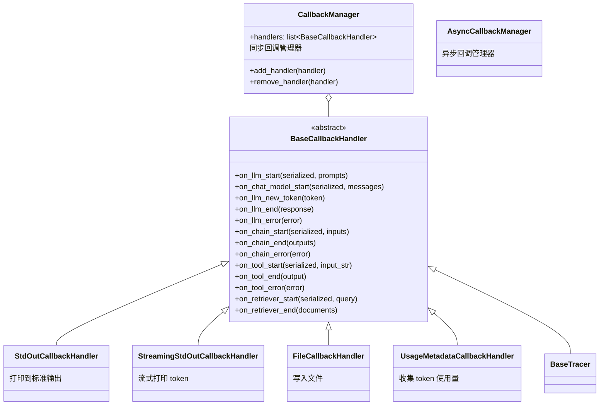
```mermaid
classDiagram
    class BaseCallbackHandler {
        <<abstract>>
        +on_llm_start(serialized, prompts)
        +on_chat_model_start(serialized, messages)
        +on_llm_new_token(token)
        +on_llm_end(response)
        +on_llm_error(error)
        +on_chain_start(serialized, inputs)
        +on_chain_end(outputs)
        +on_chain_error(error)
        +on_tool_start(serialized, input_str)
        +on_tool_end(output)
        +on_tool_error(error)
        +on_retriever_start(serialized, query)
        +on_retriever_end(documents)
    }

    class CallbackManager {
        +handlers: list~BaseCallbackHandler~
        +add_handler(handler)
        +remove_handler(handler)
        同步回调管理器
    }

    class AsyncCallbackManager {
        异步回调管理器
    }

    class StdOutCallbackHandler {
        打印到标准输出
    }

    class StreamingStdOutCallbackHandler {
        流式打印 token
    }

    class FileCallbackHandler {
        写入文件
    }

    class UsageMetadataCallbackHandler {
        收集 token 使用量
    }

    BaseCallbackHandler <|-- StdOutCallbackHandler
    BaseCallbackHandler <|-- StreamingStdOutCallbackHandler
    BaseCallbackHandler <|-- FileCallbackHandler
    BaseCallbackHandler <|-- UsageMetadataCallbackHandler
    BaseCallbackHandler <|-- BaseTracer
    CallbackManager o-- BaseCallbackHandler
```

### 10.2 追踪系统

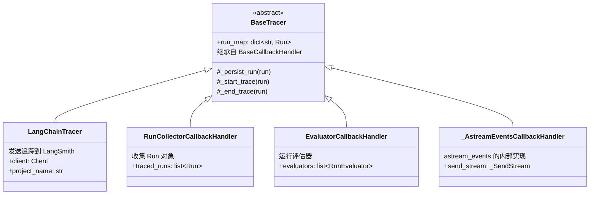
```mermaid
classDiagram
    class BaseTracer {
        <<abstract>>
        +run_map: dict~str, Run~
        #_persist_run(run)
        #_start_trace(run)
        #_end_trace(run)
        继承自 BaseCallbackHandler
    }

    class LangChainTracer {
        发送追踪到 LangSmith
        +client: Client
        +project_name: str
    }

    class RunCollectorCallbackHandler {
        收集 Run 对象
        +traced_runs: list~Run~
    }

    class EvaluatorCallbackHandler {
        运行评估器
        +evaluators: list~RunEvaluator~
    }

    class _AstreamEventsCallbackHandler {
        astream_events 的内部实现
        +send_stream: _SendStream
    }

    BaseTracer <|-- LangChainTracer
    BaseTracer <|-- RunCollectorCallbackHandler
    BaseTracer <|-- EvaluatorCallbackHandler
    BaseTracer <|-- _AstreamEventsCallbackHandler
```

### 10.3 回调事件流

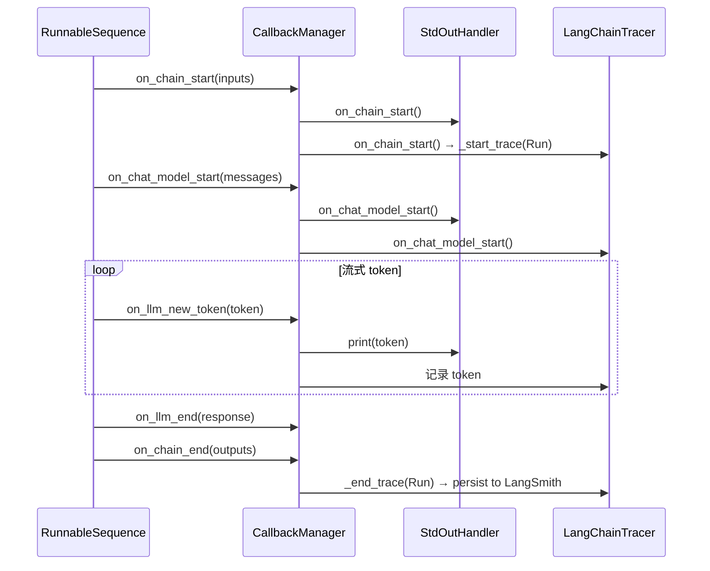
```mermaid
sequenceDiagram
    participant Chain as RunnableSequence
    participant CM as CallbackManager
    participant H1 as StdOutHandler
    participant H2 as LangChainTracer

    Chain->>CM: on_chain_start(inputs)
    CM->>H1: on_chain_start()
    CM->>H2: on_chain_start() → _start_trace(Run)

    Chain->>CM: on_chat_model_start(messages)
    CM->>H1: on_chat_model_start()
    CM->>H2: on_chat_model_start()

    loop 流式 token
        Chain->>CM: on_llm_new_token(token)
        CM->>H1: print(token)
        CM->>H2: 记录 token
    end

    Chain->>CM: on_llm_end(response)
    Chain->>CM: on_chain_end(outputs)
    CM->>H2: _end_trace(Run) → persist to LangSmith
```

---

## 11. 序列化与反序列化

### 11.1 Serializable 体系

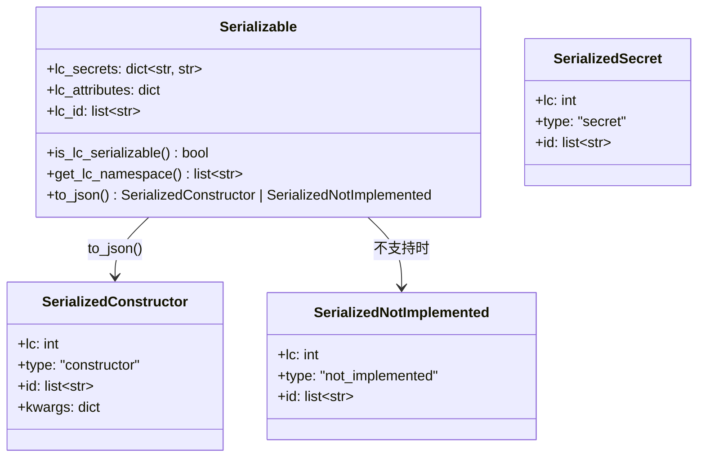
```mermaid
classDiagram
    class Serializable {
        +is_lc_serializable() bool
        +get_lc_namespace() list~str~
        +lc_secrets: dict~str, str~
        +lc_attributes: dict
        +lc_id: list~str~
        +to_json() SerializedConstructor | SerializedNotImplemented
    }

    class SerializedConstructor {
        +lc: int
        +type: "constructor"
        +id: list~str~
        +kwargs: dict
    }

    class SerializedSecret {
        +lc: int
        +type: "secret"
        +id: list~str~
    }

    class SerializedNotImplemented {
        +lc: int
        +type: "not_implemented"
        +id: list~str~
    }

    Serializable --> SerializedConstructor : to_json()
    Serializable --> SerializedNotImplemented : 不支持时
```

核心设计要点：
- `lc_secrets` 标记敏感字段（如 API key），序列化时替换为占位符
- `lc_id` 提供全局唯一标识，用于反序列化时定位类
- `get_lc_namespace()` 返回命名空间路径，如 `["langchain", "chat_models", "openai"]`
- 反序列化通过 `load/mapping.py` 中的映射表查找对应类

---

## 12. 实现层 langchain (v1)

`langchain` v1 是活跃维护的主包，提供高层工具和 Agent 系统。

### 12.1 模块结构

```mermaid
graph TB
    subgraph "langchain v1"
        CM["chat_models/<br/>init_chat_model() 工厂"]
        AG["agents/<br/>create_agent() 工厂"]
        MW["agents/middleware/<br/>Agent 中间件"]
        TL["tools/<br/>ToolNode"]
        EM["embeddings/<br/>init_embeddings()"]
        MSG["messages/<br/>消息工具"]
        RL["rate_limiters/<br/>速率限制"]
    end

    CM --> |"统一入口"| OPENAI["OpenAI"]
    CM --> ANTHROPIC["Anthropic"]
    CM --> OLLAMA["Ollama"]
    AG --> MW
    AG --> TL
```

### 12.2 init_chat_model — 统一模型工厂

```python
from langchain.chat_models import init_chat_model

# 自动推断 provider
model = init_chat_model("gpt-4o")           # → ChatOpenAI
model = init_chat_model("claude-sonnet-4-5-20250929")  # → ChatAnthropic
model = init_chat_model("llama3", model_provider="ollama")  # → ChatOllama

# 可配置模型 — 运行时切换
model = init_chat_model(configurable_fields="any")
model.invoke("hi", config={"configurable": {"model": "gpt-4o"}})
```

### 12.3 create_agent — 新一代 Agent 系统

```mermaid
flowchart TB
    subgraph "create_agent 架构"
        CA["create_agent()"] --> GRAPH["StateGraph"]
        GRAPH --> MODEL_NODE["model 节点"]
        GRAPH --> TOOLS_NODE["tools 节点"]

        MODEL_NODE --> |"tool_calls"| TOOLS_NODE
        TOOLS_NODE --> |"tool_results"| MODEL_NODE
        MODEL_NODE --> |"no tool_calls"| END["结束"]

        subgraph "中间件层 Middleware"
            MW1["ModelRetryMiddleware<br/>模型重试"]
            MW2["ModelFallbackMiddleware<br/>模型降级"]
            MW3["SummarizationMiddleware<br/>上下文摘要"]
            MW4["ModelCallLimitMiddleware<br/>调用次数限制"]
            MW5["PIIMiddleware<br/>PII 脱敏"]
            MW6["HITLMiddleware<br/>人工审核"]
            MW7["ShellToolMiddleware<br/>Shell 工具"]
            MW8["FilesystemFileSearchMiddleware<br/>文件搜索"]
            MW9["TodoMiddleware<br/>任务管理"]
        end

        MODEL_NODE -.-> MW1
        MODEL_NODE -.-> MW2
        MODEL_NODE -.-> MW3
    end
```

### 12.4 Agent 中间件详解

| 中间件 | 职责 | 关键机制 |
|--------|------|----------|
| `ModelRetryMiddleware` | 模型调用失败时自动重试 | 指数退避，可配置最大重试次数 |
| `ModelFallbackMiddleware` | 主模型失败时切换备用模型 | 有序降级链 |
| `SummarizationMiddleware` | 对话过长时自动摘要 | token 计数触发，保留最近消息 |
| `ModelCallLimitMiddleware` | 限制单次运行的模型调用次数 | 防止无限循环 |
| `PIIMiddleware` | 自动检测和脱敏 PII 信息 | 正则匹配 + 替换 |
| `HITLMiddleware` | 人工审核工具调用 | 暂停执行等待审批 |
| `ShellToolMiddleware` | 安全的 Shell 命令执行 | 沙箱环境，资源清理 |
| `ContextEdit` | 编辑上下文消息 | 清除工具使用记录等 |

---

## 13. 集成层 Partners

### 13.1 集成包全景

```mermaid
graph TB
    subgraph "LLM 提供商"
        OPENAI["langchain-openai<br/>GPT-4o, o1, o3"]
        ANTHROPIC["langchain-anthropic<br/>Claude 系列"]
        GROQ["langchain-groq<br/>Groq 加速推理"]
        OLLAMA["langchain-ollama<br/>本地模型"]
        MISTRAL["langchain-mistralai<br/>Mistral 系列"]
        DEEPSEEK["langchain-deepseek<br/>DeepSeek"]
        XAI["langchain-xai<br/>xAI Grok"]
        FIREWORKS["langchain-fireworks<br/>Fireworks AI"]
        OPENROUTER["langchain-openrouter<br/>OpenRouter 路由"]
        PERPLEXITY["langchain-perplexity<br/>Perplexity 搜索"]
    end

    subgraph "嵌入模型"
        NOMIC["langchain-nomic<br/>Nomic 嵌入"]
        HF["langchain-huggingface<br/>HuggingFace 模型"]
    end

    subgraph "向量数据库"
        CHROMA["langchain-chroma<br/>Chroma DB"]
        QDRANT["langchain-qdrant<br/>Qdrant"]
    end

    subgraph "搜索"
        EXA["langchain-exa<br/>Exa 搜索"]
    end
```

### 13.2 集成实现模式（以 OpenAI 为例）

```mermaid
classDiagram
    class BaseChatModel {
        <<langchain-core>>
    }

    class ChatOpenAI {
        +model_name: str
        +openai_api_key: SecretStr
        +temperature: float
        +max_tokens: int
        +streaming: bool
        +model_profile: ModelProfile
        #_generate(messages, stop) ChatResult
        #_stream(messages, stop) Iterator
        +bind_tools(tools) Runnable
        +with_structured_output(schema) Runnable
    }

    class AzureChatOpenAI {
        +azure_endpoint: str
        +azure_deployment: str
        +api_version: str
    }

    BaseChatModel <|-- ChatOpenAI
    ChatOpenAI <|-- AzureChatOpenAI
```

集成包的标准结构：

```
libs/partners/openai/
├── langchain_openai/
│   ├── chat_models/
│   │   ├── base.py          # ChatOpenAI 实现
│   │   ├── azure.py         # AzureChatOpenAI
│   │   └── _compat.py       # 版本兼容层
│   ├── embeddings/
│   │   ├── base.py          # OpenAIEmbeddings
│   │   └── azure.py         # AzureOpenAIEmbeddings
│   ├── data/                # ModelProfile 数据
│   └── __init__.py
├── tests/
│   ├── unit_tests/
│   └── integration_tests/
├── pyproject.toml
└── uv.lock
```

### 13.3 消息格式转换

每个集成包的核心工作之一是在 LangChain 消息格式和提供商 API 格式之间转换：

```mermaid
flowchart LR
    LC["LangChain Messages<br/>HumanMessage, AIMessage..."] --> CONV["_convert_message_to_dict()"]
    CONV --> API["Provider API Format<br/>{role, content, tool_calls...}"]
    API --> PARSE["_convert_dict_to_message()"]
    PARSE --> LC
```

---

## 14. 文本分割器 Text Splitters

### 14.1 分割器类层次

```mermaid
classDiagram
    class TextSplitter {
        <<abstract>>
        +chunk_size: int
        +chunk_overlap: int
        +length_function: Callable
        +split_text(text) list~str~
        +create_documents(texts, metadatas) list~Document~
        +split_documents(documents) list~Document~
    }

    class CharacterTextSplitter {
        +separator: str
        按单一分隔符分割
    }

    class RecursiveCharacterTextSplitter {
        +separators: list~str~
        递归尝试多个分隔符
        最常用的分割器
    }

    class MarkdownTextSplitter {
        按 Markdown 结构分割
    }

    class MarkdownHeaderTextSplitter {
        +headers_to_split_on: list
        按标题层级分割
    }

    class HTMLHeaderTextSplitter {
        按 HTML 标签分割
    }

    class PythonCodeTextSplitter {
        按 Python 代码结构分割
    }

    class LatexTextSplitter {
        按 LaTeX 结构分割
    }

    class RecursiveJsonSplitter {
        递归分割 JSON
    }

    class JSFrameworkTextSplitter {
        按 JSX/TSX 组件分割
    }

    class NLTKTextSplitter {
        基于 NLTK 句子分割
    }

    TextSplitter <|-- CharacterTextSplitter
    TextSplitter <|-- RecursiveCharacterTextSplitter
    RecursiveCharacterTextSplitter <|-- MarkdownTextSplitter
    RecursiveCharacterTextSplitter <|-- PythonCodeTextSplitter
    RecursiveCharacterTextSplitter <|-- LatexTextSplitter
    TextSplitter <|-- NLTKTextSplitter
```

### 14.2 RecursiveCharacterTextSplitter 算法

```mermaid
flowchart TD
    INPUT["输入文本"] --> TRY1["尝试用 '\\n\\n' 分割"]
    TRY1 --> CHECK1{块大小 <= chunk_size?}
    CHECK1 -->|是| DONE["输出块"]
    CHECK1 -->|否| TRY2["尝试用 '\\n' 分割"]
    TRY2 --> CHECK2{块大小 <= chunk_size?}
    CHECK2 -->|是| DONE
    CHECK2 -->|否| TRY3["尝试用 ' ' 分割"]
    TRY3 --> CHECK3{块大小 <= chunk_size?}
    CHECK3 -->|是| DONE
    CHECK3 -->|否| TRY4["逐字符分割"]
    TRY4 --> DONE

    DONE --> OVERLAP["添加 chunk_overlap 重叠"]
    OVERLAP --> RESULT["最终文档块列表"]
```

---

## 15. 标准测试框架

`langchain-standard-tests` 提供了一套标准化的测试套件，确保所有集成包行为一致。

### 15.1 测试套件结构

```mermaid
graph TB
    subgraph "标准测试套件"
        BASE["BaseStandardTests<br/>基础测试类"]

        subgraph "集成测试"
            CM_TEST["ChatModelIntegrationTests<br/>聊天模型测试"]
            EMB_TEST["EmbeddingsIntegrationTests<br/>嵌入模型测试"]
            VS_TEST["VectorStoreIntegrationTests<br/>向量存储测试"]
            RET_TEST["RetrieversIntegrationTests<br/>检索器测试"]
            TOOL_TEST["ToolsIntegrationTests<br/>工具测试"]
            CACHE_TEST["SyncCacheTestSuite<br/>缓存测试"]
            STORE_TEST["BaseStoreSyncTests<br/>KV 存储测试"]
            IDX_TEST["DocumentIndexerTestSuite<br/>文档索引测试"]
        end
    end

    BASE --> CM_TEST
    BASE --> EMB_TEST
    BASE --> VS_TEST
```

### 15.2 使用方式

```python
# 在集成包的测试中继承标准测试
from langchain_tests.integration_tests import ChatModelIntegrationTests

class TestChatOpenAI(ChatModelIntegrationTests):
    @pytest.fixture
    def chat_model_class(self):
        return ChatOpenAI

    @pytest.fixture
    def chat_model_params(self):
        return {"model": "gpt-4o-mini", "temperature": 0}
```

标准测试覆盖：
- 基本 invoke/ainvoke 调用
- 流式输出
- 工具调用（bind_tools）
- 结构化输出（with_structured_output）
- 多模态输入
- Token 使用量统计
- 序列化/反序列化

---

## 16. 辅助模块

### 16.1 速率限制器

```mermaid
classDiagram
    class BaseRateLimiter {
        <<abstract>>
        +acquire(blocking) bool
        +aacquire(blocking) bool
    }

    class InMemoryRateLimiter {
        +requests_per_second: float
        +max_bucket_size: float
        +check_every_n_seconds: float
        -available_tokens: float
        -_consume() bool
        令牌桶算法实现
    }

    BaseRateLimiter <|-- InMemoryRateLimiter
```

### 16.2 缓存系统

```mermaid
classDiagram
    class BaseCache {
        <<abstract>>
        +lookup(prompt, llm_string) list~Generation~ | None
        +update(prompt, llm_string, return_val)
        +clear()
        +alookup() / aupdate() / aclear()
    }

    class InMemoryCache {
        +maxsize: int | None
        -_cache: dict
        LRU 缓存实现
    }

    BaseCache <|-- InMemoryCache
```

### 16.3 KV 存储

```mermaid
classDiagram
    class BaseStore~K,V~ {
        <<abstract>>
        +mget(keys) list~V | None~
        +mset(key_value_pairs)
        +mdelete(keys)
        +yield_keys(prefix) Iterator~K~
        批量操作设计
    }

    class InMemoryBaseStore~V~ {
        +store: dict~str, V~
    }

    class InMemoryStore {
        存储任意类型
    }

    class InMemoryByteStore {
        存储字节数据
    }

    BaseStore <|-- InMemoryBaseStore
    InMemoryBaseStore <|-- InMemoryStore
    InMemoryBaseStore <|-- InMemoryByteStore
```

### 16.4 文档索引

```mermaid
classDiagram
    class RecordManager {
        <<abstract>>
        +namespace: str
        +create_schema()
        +get_time() float
        +exists(keys) list~bool~
        +list_keys(before, after, group_ids)
        +delete_keys(keys)
        +update(keys, group_ids, time_at_least)
        管理文档索引记录
        支持增量更新和去重
    }

    class DocumentIndex {
        <<abstract>>
        +upsert(items) UpsertResponse
        +delete(ids) DeleteResponse
        +get(ids) list~Document~
    }

    class InMemoryDocumentIndex {
        内存文档索引实现
    }

    DocumentIndex <|-- InMemoryDocumentIndex
```

---

## 17. 完整数据流：从用户输入到模型输出

### 17.1 简单链的完整执行流程

```mermaid
sequenceDiagram
    participant User as 用户代码
    participant RS as RunnableSequence
    participant PT as ChatPromptTemplate
    participant CM as BaseChatModel
    participant RL as RateLimiter
    participant Cache as BaseCache
    participant API as Provider API
    participant OP as StrOutputParser
    participant CB as CallbackManager
    participant TR as LangChainTracer

    User->>RS: chain.invoke({"topic": "AI"})
    RS->>CB: on_chain_start(inputs)
    CB->>TR: _start_trace(chain_run)

    RS->>PT: invoke({"topic": "AI"})
    PT->>PT: format_messages()
    PT-->>RS: ChatPromptValue(messages)

    RS->>CM: invoke(ChatPromptValue)
    CM->>CM: _convert_input() → messages
    CM->>CB: on_chat_model_start(messages)
    CB->>TR: _start_trace(llm_run)

    CM->>Cache: lookup(prompt, llm_string)
    alt 缓存命中
        Cache-->>CM: cached result
    else 缓存未命中
        CM->>RL: acquire(blocking=True)
        CM->>API: HTTP POST /chat/completions
        API-->>CM: response
        CM->>Cache: update(prompt, llm_string, result)
    end

    CM->>CB: on_llm_end(response)
    CB->>TR: _end_trace(llm_run)
    CM-->>RS: AIMessage

    RS->>OP: invoke(AIMessage)
    OP->>OP: parse(message.content)
    OP-->>RS: str

    RS->>CB: on_chain_end(output)
    CB->>TR: _end_trace(chain_run) → persist to LangSmith
    RS-->>User: "AI 是..."
```

### 17.2 Agent 执行循环

```mermaid
flowchart TB
    START["用户输入"] --> INIT["初始化消息列表"]
    INIT --> MODEL["调用 ChatModel"]
    MODEL --> CHECK{AIMessage 包含 tool_calls?}

    CHECK -->|否| END["返回最终回答"]
    CHECK -->|是| EXEC["执行工具调用"]

    EXEC --> MW_BEFORE["中间件: before_tool_call"]
    MW_BEFORE --> TOOL["Tool._run(args)"]
    TOOL --> MW_AFTER["中间件: after_tool_call"]
    MW_AFTER --> APPEND["追加 ToolMessage 到消息列表"]
    APPEND --> MW_MODEL["中间件: before_model_call"]

    MW_MODEL --> SUMM{需要摘要?}
    SUMM -->|是| SUMMARIZE["SummarizationMiddleware<br/>压缩历史消息"]
    SUMM -->|否| LIMIT{超过调用限制?}
    SUMMARIZE --> LIMIT
    LIMIT -->|是| ERROR["ModelCallLimitExceededError"]
    LIMIT -->|否| MODEL

    style ERROR fill:#f66
```

### 17.3 流式 Agent 执行

```mermaid
sequenceDiagram
    participant User as 用户
    participant Agent as Agent Graph
    participant Model as ChatModel
    participant Tool as Tool

    User->>Agent: astream_events(input)

    Agent->>Model: astream(messages)
    loop 模型流式输出
        Model-->>Agent: AIMessageChunk(content="思考中...")
        Agent-->>User: event: on_chat_model_stream
    end

    Note over Agent: 检测到 tool_calls
    Agent->>Tool: invoke(tool_call.args)
    Agent-->>User: event: on_tool_start
    Tool-->>Agent: result
    Agent-->>User: event: on_tool_end

    Agent->>Model: astream(messages + tool_results)
    loop 最终回答流式输出
        Model-->>Agent: AIMessageChunk(content="答案...")
        Agent-->>User: event: on_chat_model_stream
    end

    Agent-->>User: event: on_chain_end
```

---

## 18. 学习路径与面试准备

### 18.1 推荐学习路径

```mermaid
flowchart TD
    subgraph "第一阶段：基础概念（1-2 周）"
        S1A["理解 LLM 基本概念<br/>Prompt, Token, Temperature"]
        S1B["学习 Pydantic v2<br/>LangChain 的数据模型基础"]
        S1C["Python 异步编程<br/>async/await, Generator"]
    end

    subgraph "第二阶段：核心抽象（2-3 周）"
        S2A["Messages 消息体系<br/>阅读 messages/ 源码"]
        S2B["Runnable 与 LCEL<br/>阅读 runnables/base.py"]
        S2C["ChatModel 抽象<br/>阅读 language_models/chat_models.py"]
        S2D["Prompt 模板<br/>阅读 prompts/chat.py"]
    end

    subgraph "第三阶段：实战应用（2-3 周）"
        S3A["构建简单 Chain<br/>prompt | model | parser"]
        S3B["实现 RAG 应用<br/>Loader → Splitter → VectorStore → Retriever"]
        S3C["构建 Agent<br/>create_agent + Tools"]
        S3D["流式输出<br/>stream / astream_events"]
    end

    subgraph "第四阶段：深入源码（3-4 周）"
        S4A["回调与追踪系统<br/>callbacks/ + tracers/"]
        S4B["序列化机制<br/>load/serializable.py"]
        S4C["实现自定义集成<br/>继承 BaseChatModel"]
        S4D["中间件系统<br/>agents/middleware/"]
    end

    subgraph "第五阶段：生态贡献（持续）"
        S5A["阅读 standard-tests<br/>理解测试规范"]
        S5B["贡献 Partner 集成"]
        S5C["参与 Issue 讨论"]
    end

    S1A --> S2A
    S1B --> S2A
    S1C --> S2B
    S2A --> S2C
    S2B --> S2C
    S2C --> S2D
    S2D --> S3A
    S3A --> S3B
    S3B --> S3C
    S3C --> S3D
    S3D --> S4A
    S4A --> S4B
    S4B --> S4C
    S4C --> S4D
    S4D --> S5A
    S5A --> S5B
    S5B --> S5C
```

### 18.2 关键源码阅读顺序

| 优先级 | 文件 | 理由 |
|--------|------|------|
| ⭐⭐⭐⭐⭐ | `runnables/base.py` | LCEL 核心，理解 Runnable 接口 |
| ⭐⭐⭐⭐⭐ | `language_models/chat_models.py` | 所有 LLM 集成的基类 |
| ⭐⭐⭐⭐⭐ | `messages/base.py` + `messages/ai.py` | 消息数据模型 |
| ⭐⭐⭐⭐ | `prompts/chat.py` | Prompt 模板核心实现 |
| ⭐⭐⭐⭐ | `tools/base.py` + `tools/convert.py` | 工具系统 |
| ⭐⭐⭐⭐ | `callbacks/manager.py` | 回调管理器 |
| ⭐⭐⭐ | `runnables/config.py` | 配置传播机制 |
| ⭐⭐⭐ | `output_parsers/json.py` | 流式 JSON 解析 |
| ⭐⭐⭐ | `vectorstores/base.py` | 向量存储抽象 |
| ⭐⭐⭐ | `load/serializable.py` | 序列化体系 |
| ⭐⭐ | `langchain_v1/agents/factory.py` | Agent 工厂 |
| ⭐⭐ | `partners/openai/chat_models/base.py` | 集成实现范例 |

### 18.3 面试高频问题与参考答案

#### 架构设计类

**Q1: LangChain 的分层架构是怎样的？为什么这样设计？**

LangChain 采用三层架构：
- **Core 层**（langchain-core）：定义所有抽象接口（Runnable, BaseChatModel, BaseRetriever 等），不包含任何具体实现。这确保了接口稳定性和向后兼容。
- **实现层**（langchain）：提供高层工具如 `init_chat_model`、`create_agent`，以及中间件系统。
的缓存和速率限制是如何实现的？**

- **缓存**：`BaseChatModel` 在 `_generate_with_cache` 方法中实现。调用前先用 `(prompt, llm_string)` 作为 key 查询 `BaseCache.lookup()`，命中则直接返回；未命中则调用 `_generate()` 后通过 `BaseCache.update()` 写入缓存。
- **速率限制**：通过 `rate_limiter` 属性注入 `BaseRateLimiter` 实例。在每次 API 调用前调用 `rate_limiter.acquire(blocking=True)`。`InMemoryRateLimiter` 使用令牌桶算法，线程安全，支持同步和异步。

#### 核心概念类

**Q4: LangChain 的消息类型有哪些？各自的作用？**

- `HumanMessage`：用户输入
- `AIMessage`：模型响应，包含 `tool_calls` 和 `usage_metadata`
- `SystemMessage`：系统指令，设定模型行为
- `ToolMessage`：工具执行结果，通过 `tool_call_id` 关联到对应的 tool_call
- `FunctionMessage`：遗留的函数调用结果（已被 ToolMessage 取代）
- `ChatMessage`：自定义角色消息
- `RemoveMessage`：用于从对话历史中删除特定消息（在 Agent 中使用）

**Q5: 如何实现一个自定义的 ChatModel 集成？**

继承 `BaseChatModel`，至少实现：
1. `_generate(messages, stop, **kwargs) -> ChatResult`：核心生成方法
2. `_llm_type` 属性：返回模型类型标识
3. 可选实现 `_stream()` 支持流式输出
4. 可选实现 `bind_tools()` 支持工具调用
5. 可选实现 `with_structured_output()` 支持结构化输出
6. 使用 `langchain-standard-tests` 验证实现的正确性

**Q6: Runnable 的 stream 和 astream_events 有什么区别？**

- `stream()`：返回最终输出的增量块（如 AIMessageChunk），只能看到链的最终输出
- `astream_events()`：返回链中每个组件的所有事件（on_chain_start, on_chat_model_stream, on_tool_start 等），可以观察到中间步骤，适合构建复杂的 UI 反馈

#### 实战应用类

**Q7: 如何构建一个 RAG 应用？关键组件有哪些？**

关键组件和流程：
1. **DocumentLoader**：加载原始文档
2. **TextSplitter**（推荐 `RecursiveCharacterTextSplitter`）：将文档分块
3. **Embeddings**：将文本块转为向量
4. **VectorStore**：存储和检索向量
5. **Retriever**：`vectorstore.as_retriever()` 获取检索器
6. **ChatPromptTemplate**：构建包含上下文的 Prompt
7. **ChatModel**：生成回答

```python
# 典型 RAG 链
chain = (
    {"context": retriever, "question": RunnablePassthrough()}
    | prompt
    | model
    | StrOutputParser()
)
```

**Q8: LangChain Agent 的工作原理是什么？**

Agent 本质是一个循环：
1. 将用户输入和历史消息发送给 ChatModel
2. 如果模型返回 `tool_calls`，执行对应工具
3. 将工具结果作为 `ToolMessage` 追加到消息列表
4. 重复步骤 1-3，直到模型不再调用工具
5. 返回最终的文本回答

新版 `create_agent()` 基于 StateGraph 实现，支持中间件（重试、降级、摘要、人工审核等）。

**Q9: 如何处理 LLM 调用中的错误和重试？**

多层机制：
1. **Runnable 级别**：`chain.with_retry(stop_after_attempt=3)` 对任何 Runnable 添加重试
2. **Fallback 级别**：`chain.with_fallbacks([backup_chain])` 主链失败时切换备用链
3. **Agent 中间件**：`ModelRetryMiddleware` 自动重试模型调用，`ModelFallbackMiddleware` 自动降级到备用模型
4. **速率限制**：`InMemoryRateLimiter` 防止触发 API 限流

**Q10: LangChain 的回调系统如何支持可观测性？**

回调系统是 LangChain 可观测性的基础：
- `BaseCallbackHandler` 定义了所有生命周期事件（start/end/error）
- `CallbackManager` 管理多个 handler，通过 `RunnableConfig` 在链中传播
- `BaseTracer` 继承 `BaseCallbackHandler`，将事件组织为树形 Run 结构
- `LangChainTracer` 将 Run 数据发送到 LangSmith 平台
- `astream_events` 内部使用 `_AstreamEventsCallbackHandler` 将回调事件转为异步流

#### 设计模式类

**Q11: LangChain 中使用了哪些设计模式？**

1. **策略模式**：`Embeddings`、`BaseCache`、`BaseRateLimiter` 等接口允许替换不同实现
2. **装饰器模式**：`RunnableBinding` 包装 Runnable 添加额外行为（bind, with_config, with_retry）
3. **组合模式**：`RunnableSequence` 和 `RunnableParallel` 将多个 Runnable 组合为一个
4. **观察者模式**：回调系统（CallbackManager + BaseCallbackHandler）
5. **工厂模式**：`init_chat_model()` 根据模型名自动创建对应实例
6. **中间件模式**：Agent 中间件链式处理模型调用和工具调用
7. **模板方法模式**：`BaseChatModel.invoke()` 定义流程骨架，子类实现 `_generate()`

**Q12: LangChain 如何保证向后兼容性？**

1. 新参数使用 keyword-only（`*, new_param: str = "default"`）
2. 公共 API 通过 `__init__.py` 的 `__all__` 显式导出
3. 使用 `_api/` 模块中的装饰器标记 deprecated 和 beta API
4. Core 层接口极少变更，变更通过新增方法而非修改签名
5. 集成包独立版本管理，可以独立升级

---

### 18.4 进阶学习资源

| 资源 | 链接 | 说明 |
|------|------|------|
| 官方文档 | https://docs.langchain.com | 最权威的使用指南 |
| LangSmith | https://smith.langchain.com | 可观测性平台 |
| LangGraph | https://github.com/langchain-ai/langgraph | 状态图 Agent 框架 |
| 源码仓库 | https://github.com/langchain-ai/langchain | 本分析基于此仓库 |
| Contributing Guide | https://docs.langchain.com/oss/python/contributing/overview | 贡献指南 |

---

> 本文档基于 LangChain Python monorepo 源码分析生成，分析时间：2026 年 4 月。
> 项目持续演进中，建议结合最新源码阅读。
